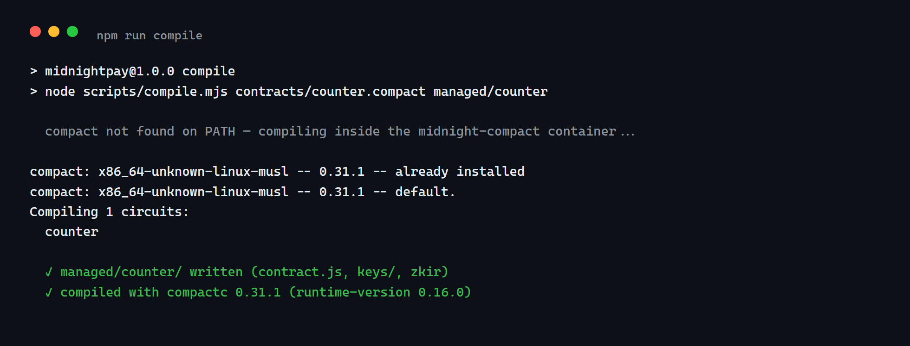
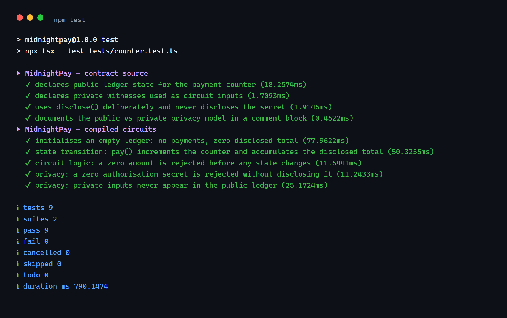
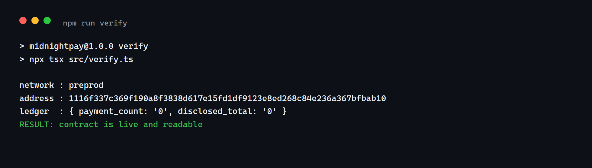

# MidnightPay

> A privacy-preserving payment counter for the Midnight Network — settle payments where the amount travels only when the payer chooses to disclose it.

## Contract Address

| Network  | Address                          |
|----------|----------------------------------|
| Preview  | `522079c2760b58d0e098c5a2d8f04a1d6e6340f8baf7a190376204378307415d` |
| Preprod  | `1116f337c369f190a8f3838d617e15fd1df9123e8ed268c84e236a367bfbab10` |

### Deployer Addresses

The wallets that submitted each deployment transaction:

| Network | Deployer |
|---------|----------|
| Preview | `mn_addr_preview12j6n7uf2wmg76e2806mvfkhxhpfel26xf7harkt5x7cy6ert0eyqlpg64q` |
| Preprod | `mn_addr_preprod1nqwdmsv67cnllvlf4sfnamus7ewtsxcxyy7n3jtrkdq25529wtdq6wnpjm` |

## What This Does

MidnightPay is a Compact smart contract that counts settled payments on a public
ledger while keeping the payment details private by default.

Every `pay()` call does three things:

1. Reads the payment amount and the payer's authorisation secret from **local
   witnesses** — they never leave the payer's machine.
2. Proves (inside a zero-knowledge circuit) that the amount is positive and that
   the payer knows a non-zero authorisation secret.
3. Publishes only what the contract deliberately discloses: the amount the payer
   chose to make public, and the increment of the payment counter.

An outside observer sees *how many* payments settled and *which* amounts were
disclosed — never the authorisation secret, and never an amount the payer did not
explicitly publish.

## Privacy Model

- **What is PUBLIC (on-chain, visible to anyone):**
  - `payment_count: Counter` — how many payments have been settled.
  - `disclosed_total: Uint<64>` — the running sum of amounts the payer explicitly
    published through `disclose()`.

- **What is PRIVATE (private witness, never on-chain):**
  - `pay_amount()` — the private payment amount.
  - `pay_secret()` — the payer's authorisation secret.
  - Neither value is ever passed to `disclose()`; the compiler rejects any
    accidental leak of witness-derived data as a compile-time error.

- **What the user PROVES without revealing:**
  - That they know a non-zero authorisation secret (asserted, never disclosed).
  - That the private payment amount is strictly positive.
  - That the resulting public ledger update follows the contract rules.

## Tech Stack

- **Midnight network** — privacy-first L1 for zero-knowledge smart contracts
- **Compact language** — the contract language (`contracts/counter.compact`)
- **Node.js v22+** — runtime for compile/deploy/test scripts
- **Docker** — proof server + local devnet (`midnightntwrk/proof-server:8.1.0`)
- **Compact compiler** — `compact compile` generates `managed/counter/`
- **midnight.js SDK** — `@midnight-ntwrk/compact-runtime`, `@midnight-ntwrk/midnight-js-*`

## Prerequisites

| Requirement | Notes |
|-------------|-------|
| Node.js 22+ | `node --version` |
| Docker Desktop | Running daemon, `docker ps` succeeds |
| Compact compiler | Linux/macOS: `compact --version` prints a version number. **On Windows there is no native binary** — and `compact` on PATH is usually `C:\Windows\system32\compact.exe`, which is Windows' *disk-compression* utility, not the Compact compiler (it happily prints a version number and fools the check). `npm run compile` detects the missing compiler and builds/runs the container in `scripts/Dockerfile.compact` instead, so on Windows just run `npm run compile`. |
| Git | For cloning and committing |
| Faucet tNIGHT | Preview: https://midnight-tmnight-preview.nethermind.dev/ — Preprod: https://faucet.preprod.midnight.network (both require the Cloudflare Turnstile, so use the browser UI) |

## Setup

```bash
git clone https://github.com/CodingAngel1/MidnightPay.git
cd MidnightPay
npm install
# npm install also runs scripts/patch-node-client.mjs, which fixes a
# socket race in the wallet SDK that otherwise aborts every submission.

# Compact compiler — Linux/macOS native install
#   curl --proto '=https' --tlsv1.2 -LsSf https://github.com/midnightntwrk/compact/releases/latest/download/compact-installer.sh | sh
#   compact update 0.31.1
# Windows: skip the above. `npm run compile` detects the missing compiler and
# builds/runs the container defined in scripts/Dockerfile.compact instead.

# Proof server (pinned to 8.1.0 to match the Midnight.js 4.1.1 SDK).
# Start it through compose: it creates exactly one container,
# `midnightpay-proof-server`. A bare `docker run --name midnight-proof-server`
# produces a second copy that stays behind Exited (255) after Docker restarts.
docker pull midnightntwrk/proof-server:8.1.0
docker compose up -d proof-server     # only the proof server — not the devnet

# Compile the contract -> managed/counter/
npm run compile

# Deploy to the preview testnet (prints the wallet address, then waits for the faucet)
NODE_OPTIONS="--max-old-space-size=12288" npm run deploy -- --network preview

# Select the active network for later commands
npm run network preview

# ── Or deploy to preprod ──────────────────────────────────────────────────────
# 1. Pick the network, then read the address to fund (no sync needed):
npm run network preprod
npx tsx src/fund-address.ts          # prints the bech32 address + faucet URL

# 2. Fund it at https://faucet.preprod.midnight.network (browser; Turnstile).

# 3. Deploy. First sync on a brand-new preprod address replays the whole
#    private-ledger history from the indexer (the dust ledger alone is
#    ~1.5M events) — expect roughly 3–4 hours of sustained CPU, then the
#    deploy itself takes seconds. The wallet writes checkpoints to
#    .midnight-wallet-state/ only AFTER a successful sync, so an
#    interrupted first run starts over: run it detached (nohup / start)
#    and do not let your session die mid-sync.
NODE_OPTIONS="--max-old-space-size=12288" npm run deploy -- --network preprod
```

> After the first successful preprod sync the state is cached, so any later
> re-deploy resumes in seconds instead of hours.

> **Compiler version is pinned to `0.31.1`.** It is the release whose
> `runtime-version` is `0.16.0`, which is exactly what `@midnight-ntwrk/compact-runtime`
> 0.16.0 in `package.json` expects. Compiling with a newer compiler (0.34.0 emits
> runtime 0.19.0) makes the test suite fail with a version-mismatch error.

## Run Tests

```bash
npm run compile && npm test
```

The suite has two layers:

- **Offline layer** — always runs; asserts the contract source really declares the
  public ledger state, the private witnesses, a deliberate `disclose()` and the
  public/private comment block.
- **Compiled layer** — runs the real generated circuits in the Compact runtime
  simulator: initial state, state transitions, rejected inputs, and that private
  inputs never reach the public ledger.

## Verify the Deployment

Read the public ledger back from the indexer to prove the contract is live.
`npm run verify` uses the active network from `.midnight-state.json`
(`npm run network <name>` to switch):

```bash
npm run verify
```

Expected output for a freshly deployed contract (active network: preprod):

```
network : preprod
address : 1116f337c369f190a8f3838d617e15fd1df9123e8ed268c84e236a367bfbab10
ledger  : { payment_count: '0', disclosed_total: '0' }
RESULT: contract is live and readable
```

On preview the same command prints `network : preview` and the preview
address from the table above.

`payment_count` and `disclosed_total` are the two public ledger fields — both
start at zero and only change when `pay()` settles a payment. Nothing else about
a payment ever reaches the chain.

## Initial Idea

Most payment systems treat "who paid how much" as a single blob of data that
everyone gets to see. MidnightPay started from a simpler question: **what if the
fact of a payment could be public while the details stayed with the payer?**

The first iteration was just a counter. The interesting part turned out to be
the split — a public ledger that only ever learns *how many* payments settled
and *which* amounts the payer deliberately published, while the amount itself
and the payer's authorisation secret live exclusively inside private witnesses.
The zero-knowledge circuit proves the rules were followed (positive amount,
non-zero secret) without ever revealing either value.

That split is the whole product: privacy by default, disclosure by choice —
payment settlement where the payer, not the chain, decides what the world gets to know.

## Screenshots

**Compile** — `npm run compile` (compiler pinned to 0.31.1, Docker fallback on Windows):



**Tests** — `npm test` (9/9 passing, source + compiled-circuit layers):



**On-chain verification** — `npm run verify` (public ledger read back from the preprod indexer):



> Regenerate with `node scripts/screenshots.mjs` (uses headless Chrome) so the
> images always match the current output.
